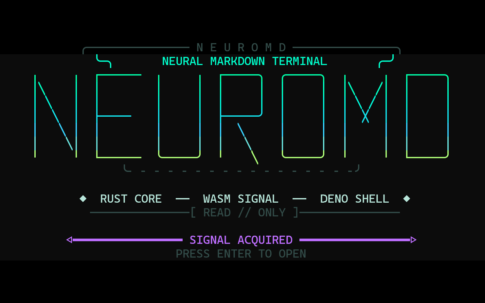

# NeuroMD MVP

NeuroMD is a local, read-only terminal Markdown viewer. Markdown parsing and terminal rendering happen in a small Rust WebAssembly module; Deno supplies the terminal, Kokoro connection, and capability sandbox. It is not a website and does not start a server.



The viewer tracks terminal resizing and redraws to use the full available width and height.
It maintains a true-black application background across ANSI style resets and restores the terminal's normal colors when it exits.
Resize events are debounced to avoid repaint stutter in embedded and docked terminal emulators.
The startup ident also redraws after a dock or window resize instead of allowing the
terminal to reflow an obsolete frame. Its visible `v0.3.0` marker identifies the
running build in screenshots and issue reports.

## Run

Requirements: Windows Terminal (or another ANSI terminal) and Deno 2.3 or newer.

Install the signed Deno runtime once:

```powershell
winget install --id DenoLand.Deno
```

Extract this entire directory first. Then double-click `NeuroMD.cmd` to open the
included demo. You can also drag any `.md` file onto `NeuroMD.cmd`.

The launcher locates `neuromd.ts`, `neuromd_engine.wasm`, and `demo.md` relative
to itself, so it works regardless of PowerShell's current directory.

To launch it from a terminal in any directory:

```powershell
& "C:\path\to\NeuroMD-MVP\NeuroMD.cmd" "C:\path\to\README.md"
```

Alternatively, change into the extracted directory and use the Deno task:

```powershell
Set-Location "C:\path\to\NeuroMD-MVP"
deno task view -- demo.md
```

Open any Markdown file from that directory:

```powershell
deno task view -- "C:\path\to\README.md"
```

## Make NeuroMD available as the default

Double-click `Register-NeuroMD.cmd`. It registers NeuroMD as an `.md` handler
for the current Windows user and opens the correct Default Apps page. No
administrator rights are required.

On the page Windows opens, select `.md`, choose **NeuroMD**, and confirm. Windows
requires this final user choice and does not permit applications to silently
replace a default handler.

The registered open command launches the signed Deno runtime directly. NeuroMD
receives read access for the Markdown file, temporary-directory write access for
WAV playback, network access to Kokoro, and permission to launch the built-in
Windows PowerShell WAV player. Native FFI remains denied. Deno and Windows still
enforce the current user's ordinary filesystem permissions.

Install `neuromd` as a command from this directory:

```powershell
deno install -g --allow-read --deny-write --deny-net --deny-run --deny-ffi --name neuromd .\neuromd.ts
neuromd .\demo.md
```

The generated command points to this directory, so keep the directory in place after installation. Remove it with `deno uninstall -g neuromd`.

## Keys

The startup ident remains on screen until you press Enter.

- `j`, `k`, arrows: move one line
- `Page Down`, `Page Up`, Space: move one page
- `g`, `G`, Home, End: jump to the beginning or end
- `r`: toggle rendered Markdown and source
- `R`: reload the file
- `s`: start or stop Kokoro narration at the current top line
- `L`: show or hide the 16-row NeuroMD logo
- `?`: show key help
- `q`, Ctrl-C: quit

## Kokoro narration

Press `s` to read from the current top line. NeuroMD requests short WAV chunks,
plays them through Windows' built-in `System.Media.SoundPlayer`, highlights the
active Kokoro word or phoneme group, and scrolls when the highlight leaves the
screen. Press `s` again to stop immediately.

Copy `neuromd.example.json` to `neuromd.json` beside `NeuroMD.exe` or beside the
Deno executable used to run the source, then set the Kokoro base URL, voice, and
speed. The local configuration file is ignored by Git. Command-line options take
precedence:

```powershell
.\NeuroMD.exe --kokoro-url http://127.0.0.1:8880 --voice af_bella --speed 1 README.md
```

NeuroMD first tries Kokoro-FastAPI's `/dev/captioned_speech` endpoint for exact
timestamps. If a reverse proxy exposes only `/v1/audio/speech`, narration still
works and highlighting uses WAV-duration-weighted estimates; the footer reports
`EXACT WORD TIMING` or `ESTIMATED WORD TIMING` while it reads.

## Build the Rust engine

Install Rust and the WebAssembly target, then run:

```powershell
rustup target add wasm32-unknown-unknown
cargo build --release --target wasm32-unknown-unknown
Copy-Item .\target\wasm32-unknown-unknown\release\neuromd_engine.wasm .\neuromd_engine.wasm
```

The checked-in `neuromd_engine.wasm` is the only build artifact required at runtime.

## Security boundary

NeuroMD receives filesystem read permission so it can open the path supplied by
the user. Narration additionally needs temporary-file write access, network
access to the configured Kokoro server, and permission to start
`powershell.exe` for WAV playback. It receives no native FFI permission and does
not modify the Markdown file. The Rust WebAssembly module has no WASI imports
and cannot access the operating system directly; Deno passes Markdown bytes into
it and receives rendered terminal text back.
